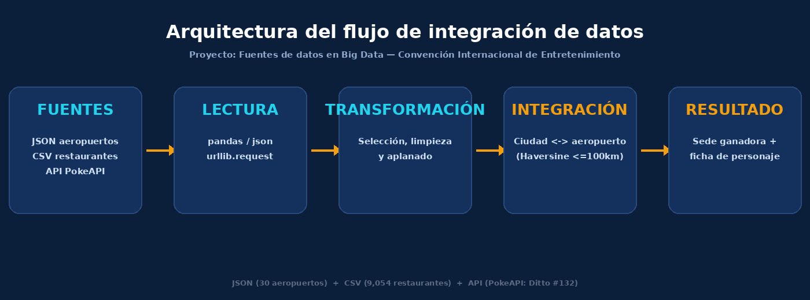

# Proyecto Big Data — Fuentes de Datos y Selección de Sede

**Unidad 3 — Fuentes de datos en Big Data**
**Problemática

## Contexto

Un comité organizador debe elegir la ciudad sede de la próxima Convención
Internacional de Cultura Pop y Gaming. La sede debe garantizar:
- Accesibilidad logística: terminal aérea internacional a menos de 100 km.
- Excelente oferta gastronómica para los visitantes.

Además, se debe generar la ficha técnica del personaje mascota del evento
(Ditto #132) para incluirla en el folleto informativo.

## Fuentes integradas

| Fuente | Formato | Contenido |
|---|---|---|
| `data/airports.json` | JSON (semiestructurado) | 30 aeropuertos clave con coordenadas |
| `data/Zomato_Restaurant_Dataset.csv` | CSV (estructurado) | 9,551 restaurantes a nivel mundial |
| PokeAPI — `https://pokeapi.co/api/v2/pokemon/ditto` | API pública (JSON) | Ficha técnica del personaje mascota |

## Arquitectura del flujo



`Fuentes → Lectura → Transformación → Integración → Resultado`

1. **Lectura**: se cargan las tres fuentes y se identifica su estructura.
2. **Transformación**: se seleccionan columnas relevantes, se limpian datos
   (coordenadas inválidas, calificaciones en 0, nombres de ciudad dañados) y
   se aplana el JSON anidado de la API.
3. **Integración**: cada ciudad candidata (agregado del CSV) se cruza con el
   aeropuerto más cercano del JSON usando la distancia Haversine.
4. **Resultado**: se determina la sede ganadora y se genera el informe
   consolidado junto con la ficha del personaje mascota.

## Resultado esperado

Con los criterios de accesibilidad aérea (≤100 km) y calificación
gastronómica, el script determina que **Londres** (cerca del aeropuerto
**LHR**) es la sede ganadora, con una calificación gastronómica de **4.53**.

## Cómo ejecutar

```bash
git clone <url-de-tu-repositorio>
cd proyecto-big-data
pip install -r requirements.txt
python src/main.py
```

El script funciona sin conexión a internet (usa un respaldo local de la API
si la consulta falla), pero se recomienda ejecutarlo con internet para
obtener la respuesta real y más reciente de PokeAPI.

## Estructura del repositorio

```
proyecto-big-data/
├── README.md
├── requirements.txt
├── src/
│   └── main.py
├── data/
│   ├── Zomato_Restaurant_Dataset.csv
│   ├── airports.json
│   └── README.md
└── docs/
    ├── arquitectura.png
    └── evidencias/
        ├── informe_convencion.txt
        ├── informe_convencion.json
        └── ciudades_candidatas.csv
```

## Equipo

- Valentin Almaraz Martinez
- Alberto Saul Lopez Crespo
- Gustavo Adalid Catalan Carmen
